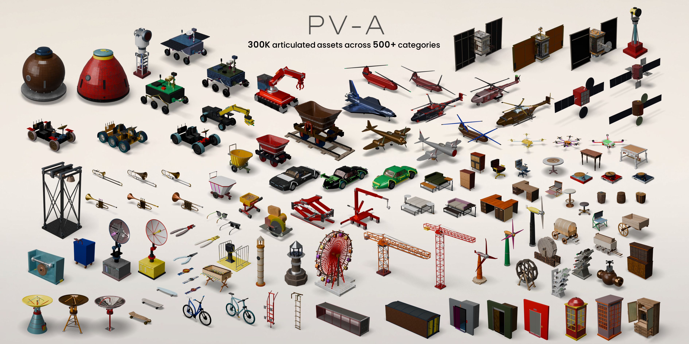

# RFW-A: Agentic Procedural Generation of 300K Articulated Assets over 500 Categories

Anonymous authors

[Overview](#overview) · [Dataset](#dataset) · [Citation](#citation) · [Release Plan](#release-plan)

<b>RFW-A-300K</b>: 300K procedurally generated articulated assets spanning 500+ object categories, with high structural and kinematic validity and stable execution across physics simulators.

---

## Overview

**From reusable construction logic to 300K simulation-ready articulated assets.** RFW-A combines agentic synthesis with procedural generation: agents construct and refine category-level generators from existing articulated programs, and validated generators produce diverse articulated assets through procedural execution — no further model inference required.

| Stage | What happens |
| --- | --- |
| **Agentic synthesis** | Agents construct and refine category-level generators from existing articulated programs, so construction logic is reused rather than relearned per instance |
| **Procedural generation** | Validated generators produce diverse articulated assets through procedural execution, requiring no further model inference |
| **Validation** | Generated assets are checked for structural and kinematic validity and for stable execution across physics simulators |

---

## Paper

**RFW-A: Agentic Procedural Generation of 300K Articulated Assets over 500 Categories** 
Anonymous authors

The arXiv preprint and supplementary material are coming soon. See the [release plan](#release-plan) for the planned timeline.

---

## Dataset

The full dataset is planned for release on **ModelScope** in **November 2026**. The official dataset link, inventory, directory structure, download instructions, and usage examples will be added here when available.

**ModelScope dataset:** [RoboFlywheel/Articulation](https://modelscope.cn/datasets/RoboFlywheel/Articulation) · **Release:** November 2026

---

## Citation

Citation information will be added with the paper release.

---

## License

License terms will be announced with the corresponding code and data releases.

---

## Release Plan

- [ ] Asset pipeline and code — October 2026
- [ ] Full dataset on ModelScope — November 2026
- [ ] Paper on arXiv — TBD